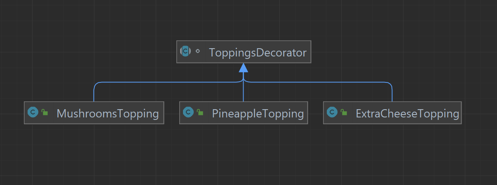

# Pizzeria Order Application🍕
## Overview
The Pizza Order Processing 
App is a simple Java console application that allows customers to place pizza orders with various toppings. The application utilizes design patterns such as Singleton, Factory, Observer, Decorator, Strategy and Adapter to demonstrate a modular and extensible design.
## Features
1. **Pizza ordering.** The application allows users to order various pizza from the menu.
2. **Adding toppings.** Users can freely add a variety of toppings to their pizza.
3. **Checkout.** Of course, after  placing an order the customer can check out, with the ability to print the check in KZT.
4. **Order status.** The customers can monitor their order status from the moment it reaches the kitchen, to the moment they get it.
## UML Diagram
### Types of pizzas:

### Types of toppings:

### Order processing:

### Order logistics:

## Design Patterns use:
### Singleton
```java
PizzaOrderProcessing pizzaOrderProcessor = PizzaOrderProcessing.getInstance(pizzaFactory, usd);
```
The Singleton pattern ensures that only one instance of an order can be accesed by the user.
### Factory
```java
public class PizzaFactory {
    public Pizza createMargheritaPizza(){
        return new MargheritaPizza();
    }
    public Pizza createNeapolitanPizza(){
        return new NeapolitanPizza();
    }
    public Pizza createHawaiianPizza(){
        return new HawaiianPizza();
    }
    public Pizza createPepperoniPizza(){
        return new PepperoniPizza();
    }
}
```
The Factory pattern allows the program to create instances of different pizzas in a separate Factory class, which improves code integrity and opens it for extention.
### Decorator
```java
abstract class ToppingsDecorator implements Pizza{
    protected Pizza pizza;

    public ToppingsDecorator(Pizza pizza){
        this.pizza = pizza;
    }
}
```
The Decorator pattern allows the users to add a variety of toppings to their pizza. For instance, this topping which modifies the pizza's name and price:
```java
public class MushroomsTopping extends ToppingsDecorator{
    public MushroomsTopping(Pizza pizza){
        super(pizza);
    }

    @Override
    public String getName() {
        return pizza.getName() + " with mushrooms";
    }
    @Override
    public double getPrice() {
        return pizza.getPrice() + 1.99;
    }
}
```
### Adapter
```java
public class CurrencyAdapter implements Currency {
    private double exchangeRate;
    private Currency originalCurrency;

    public CurrencyAdapter(Currency originalCurrency, double exchangeRate){
        this.originalCurrency = originalCurrency;
        this.exchangeRate = exchangeRate;
    }
    @Override
    public String getSymbol() {
        return "₸";
    }
    @Override
    public double convertPrice(double originalPrice) {
        return originalPrice * exchangeRate;
    }
}
```
The Adapter pattern allows to print the check with a different currency than the one initially used in calculations. In the case of this program, it allows to print the check with KZT currency instead of USD, used by default.
### Strategy 
```java
public interface Pizza {
    String getName();
    double getPrice();
}
```
All pizza classes share a common Pizza interface that they implement, this allows for code management and extension, as it is very easy to add a new type of pizza to the interface.
```java
public class PepperoniPizza implements Pizza{
    @Override
    public String getName() {
        return "Pepperoni Pizza";
    }
    @Override
    public double getPrice() {
        return 14.99;
    }
}
```
Observer
```java
public class PizzaOrderLogistics implements Subject {
    private List<Observer> observers = new ArrayList<>();
    private String orderStatus = "Order Placed";
    private List<Pizza> pizzas = new ArrayList<>();
    @Override
    public void registerObserver(Observer observer) {
        observers.add(observer);
    }

    @Override
    public void removeObserver(Observer observer) {
        observers.remove(observer);
    }

    @Override
    public void notifyObservers() {
        for (Observer observer : observers) {
            observer.update(orderStatus, pizzas);
        }
    }

    public void setOrderStatus(String newStatus, List<Pizza> pizzas) {
        this.orderStatus = newStatus;
        this.pizzas = pizzas;
        notifyObservers();
    }

    public void prepareOrder() {
        // Simulate the time it takes to prepare the order with a countdown
        for (int i = 5; i > 0; i--) {
            System.out.println("Preparing order... Time remaining: " + i + " minutes");
            try {
                Thread.sleep(1000); // Sleep for 1 second (1000 milliseconds)
            } catch (InterruptedException e) {
                e.printStackTrace();
            }
        }
        System.out.println("Order prepared!");
        setOrderStatus("Prepared", pizzas);
    }

    public void deliverOrder(){
        for (int i = 10; i > 0; i--) {
            System.out.println("Delivering order... Time remaining: " + i + " minutes");
            try {
                Thread.sleep(1000); // Sleep for 1 second (1000 milliseconds)
            } catch (InterruptedException e) {
                e.printStackTrace();
            }
        }
        System.out.println("Order delivered!");
        setOrderStatus("Delivered", pizzas);
    }
}
```
The Observer pattern allows to open communication between parts of the pizzeria, and update the order status. Observers allows the customer to track their order status, and allow the kitchen to receive orders from the customers.

